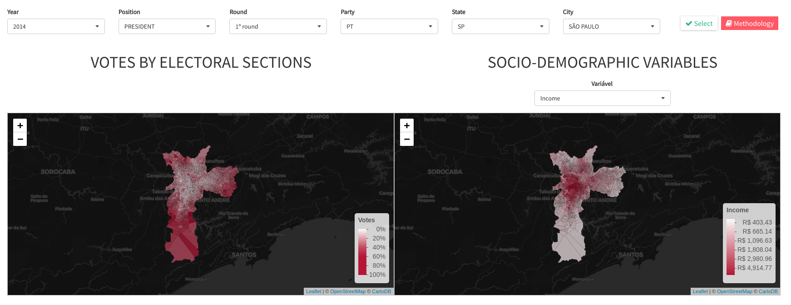
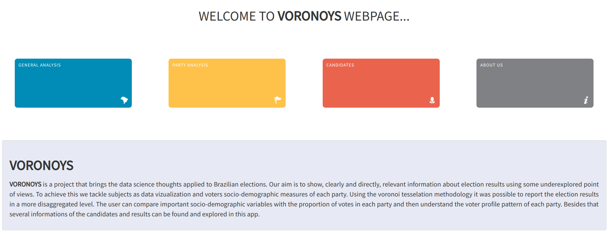
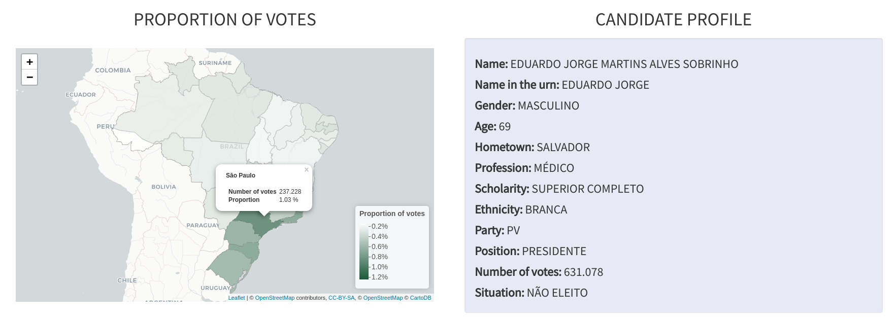

Voronoys 
==========================================================================================================================

About the app
-------------

**VORONOYS** is a team composed by four statisticians and a political scientist. It begins motivated by the first CEPESP Data challenge , in which the main objective was to show new perspectives on the Brazilian elections. The name is based on the mathematical technique used in this work called Voronoi tessellation.

Links
-----

-   Live version: [Voronoys - Live app](https://voronoys.shinyapps.io/voronoys/)
-   RStudio cloud: [Voronoys - RStudio cloud](https://rstudio.cloud/project/255741)
-   GitHub: [Voronoys - Github](https://github.com/voronoys/voronoys_sc)

Quick reading: Highlights
-------------------------

This tool provides to its users a deep access to Brazilian election results. It enablesto create general maps, plots, and tables by states and cities. It also enables investigate some under reported analysis, the case of the number of coalitions for example. As Brazil has nowadays 35 parties, our tool provides the users a huge number of analysis possibilities.

Besides the general visualizations, we also provide a new way to investigate Brazilian elections. In Brazil, electoral data has four main aggregation levels: state, municipality, electoral zone and electoral section. The lower one, the electoral section, does not have any administrative division, i.e., it is just an address and not an area. Considering that social-demographic variables can be useful to explain the election outcome, we are interested in aggregating such kind of data, provided by the Instituto Brasileiro de Geografia e Estatistica (IBGE) in small areas called census sectors. The variables extracted from the census sectors to the electoral sections are income, household, illiteracy rate, proportion of white people, and proportion of women. The outcome of interest, available on electoral section data, is the proportion of votes in each party. As a consequence, it is possible to understand voters characteristics each party as well as a smoothed result of the election at an electoral section level (voronoi cells).

With this tool it is possible to check some hypothesis about characteristics of each party voters. Is it true that low-income people vote in left-wing parties? And white people? Feel free to check the voters of our 35 parties!

General idea
------------

Our main aim is to provide a non-conventional tool to visualize Brazilian elections in which the user is able to understand the information clearly and directly. As a consequence, everyone is able to use and understand this tool.

A differential feature of our app is the possibility to visualize Brazilian elections in a less aggregated level. Nowadays, the lowest areal level in which such data can be analyzed is municipalities. We provide a way to visualize the elections inside each city because we believe that big cities have a huge variety of realities and then a unique score for each city is not representative. To visualize the results in each city we used the voronoi tessellation technique in order to create polygons indexed by the addresses of electoral sections in São Paulo state.

We assumed that voters prefer to vote near their houses. Then using censitary information we can contrast two layers of polygons: 1) censitary regions; 2) Voronoi cells, created using electoral sections. Hence, it is possible to compare the populations of different parties and to understand their main characteristics.

Visualizations
--------------

The first screen give to user four tabs:

### General analysis

In this tab the user can find visualizations at federal and state levels. Winners by state/city and each candidate number of votes are some examples of outputs in this tab.

### Party analysis

Here it is possible to understand how political parties are related in federal and state level. The parties more represented in each state, coalitions and socio-demographic information of the politicians in each party are examples of outputs in this tab.

### Candidates

Voronoi methodology in practice and also personal informations of each politician. Socio-demographic information of parties voters and each candidate votes by cities are some example of outputs in this tab.

We have restricted data for years 2014 and 2016 for operational reasons.
